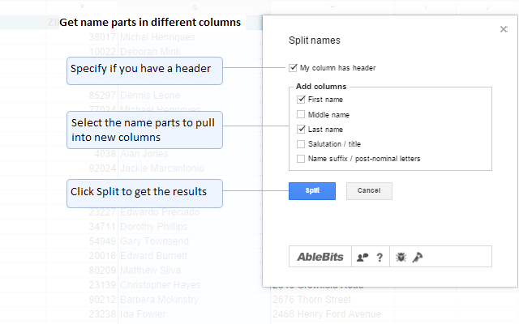
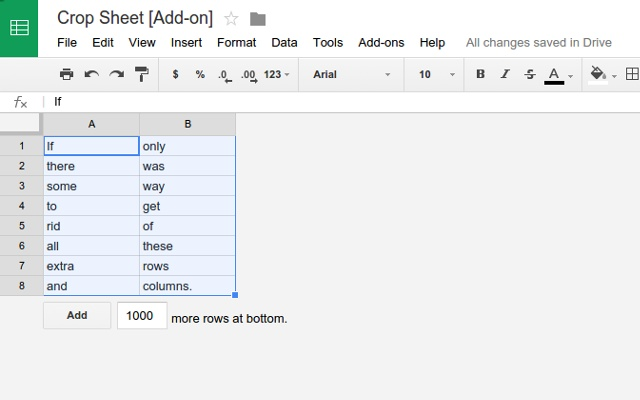
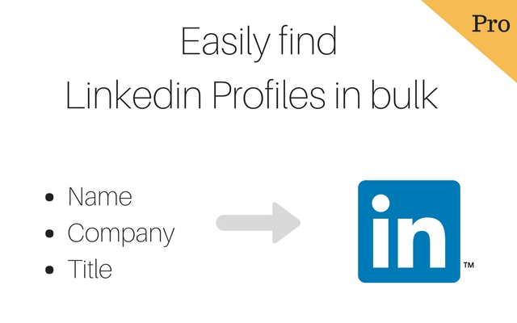
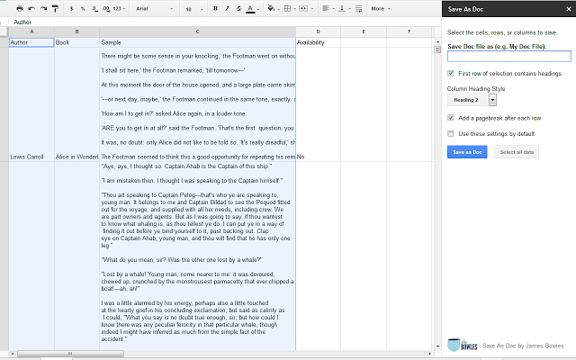
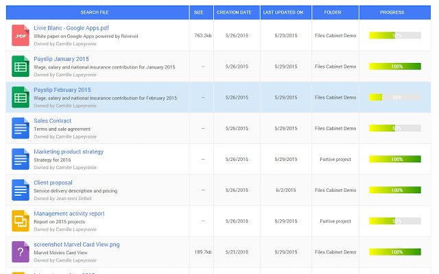
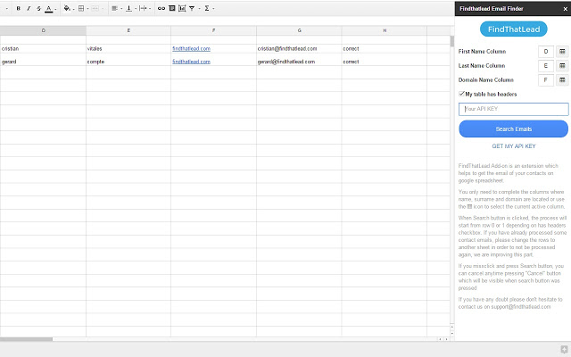
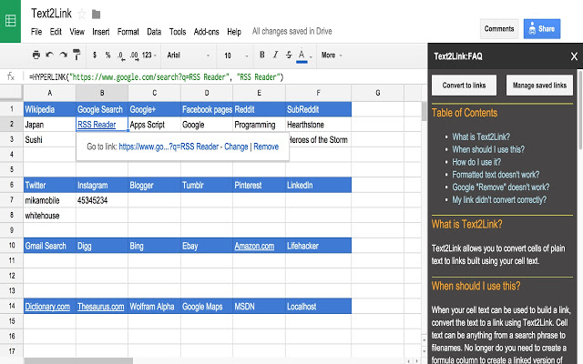

> **This was originally posted on the SourceCon Blog, you can check it** [**here.**](https://www.sourcecon.com/10-must-have-google-sheets-add-ons-for-sourcers-and-recruiters/)

### 📌 [**YAMM**](https://chrome.google.com/webstore/detail/yet-another-mail-merge/mgmgmhkohaenhokbdnlpcljckbhpbmef?utm_source=permalink)

This powerful add-on allows you to create a personalized, mass email campaigns without accessing candidates' spam folder. Track open/reply rate, do follow-ups based on specific groups of leads (who opened/not seen etc.)

It is also cool that it creates a separate labels for each campaign so you can access that data in easy way. Here's a short tutorial on how it works 👇

<Embed src="https://www.youtube.com/embed/OVklSUoQGgg?feature=oembed" aspectRatio={undefined} caption="" />

---

### 📌 [**Power Tools**](https://chrome.google.com/webstore/detail/power-tools/dofhceeoedodcaheeoacmadcpegkjobi?utm_source=permalink)

Set of tools for daily tasks: change case; sum by color; remove duplicates; split, merge, compare, find, clean up data and more.

Woking with the huge amount of data? This add-on is your way to go. Easily remove repeatable emails from the recently aggregated list of prospects/attendees/candidates etc. And much more data processing features included.

<Embed src="https://www.youtube.com/embed/IuubKrtejNQ?feature=oembed" aspectRatio={undefined} caption="" />

---

### 📌 [**Split Names**](https://chrome.google.com/webstore/detail/split-names/omjobieogknhhlogiaeofbdpipihaanb?utm_source=permalink)

Quickly split full names to several columns with first, middle, last names, titles, and/or post-nominal letters.

Nothing more to add here :)

---

### 📌 [**Crop Sheet**](https://chrome.google.com/webstore/detail/crop-sheet/aojcceglbipehndciapjedoomockgagl?utm_source=permalink)

Tired from scrolling up and down through the spreadsheet. Me too!

This add-on provides the ability to quickly remove extra rows and columns from a sheet. Fantastic!

---

### 📌 [**LinkedIn Profiles Search**](https://chrome.google.com/webstore/detail/linkedin-prospector-linke/klgmdeljhnhemfambmjhkpeoejinnffi?utm_source=permalink)

This add-on is really helpful if has some data and looking for cross-reference it with LinkedIn profiles in a bulk.

Obviously that is not provide you with a direct profile URL, but still provide you with someone's profile listed in search results.

It do works all the time if the full name and the company name (past or current) are both being relevant.

---

### 📌 [**Blockspring**](https://chrome.google.com/webstore/detail/blockspring/aihldeahgcpbpmimkdpkafaedhbmfhoh?utm_source=permalink)

Do anything in a spreadsheet. Connect Google Sheets to 100s of web apps and services to automate more of your work.

There are a lot of how-to/step-by-step guides are available, but if that's smth you've never heard about, than the video below is definitely worth a check 👇

<Embed src="https://www.youtube.com/embed/iogmAtZipKU?feature=oembed" aspectRatio={undefined} caption="" />

---

### 📌 [**Save As Doc**](https://chrome.google.com/webstore/detail/save-as-doc/iekpcmcpnbgoldpmhfbioecljjjjnpap?utm_source=permalink)

Convert any Google Sheets spreadsheet into a Google Document for improved legibility of lengthy cell text entries.

---

### 📌 [**Files Cabinet**](https://chrome.google.com/webstore/detail/files-cabinet-by-awesome/obmjbphplaacknapcnebijpkmghknmdo?utm_source=permalink)

Quickly list all the files of a Google Drive folder in a spreadsheet, and automatically display it in an Awesome Table view.

---

### 📌 [**FindThatLead**](https://chrome.google.com/webstore/detail/findthatlead/hccnakjikgbipoepjmgldknilagejoaa?utm_source=permalink)

Their extension allows you to generate the email of your contacts from a Google Spreadsheet.

---

### 📌 [**Text2Link**](https://chrome.google.com/webstore/detail/text2link/nmbohbjomdeefamnmbmicgmgomgddpea?utm_source=permalink)

Convert cells into links based on the cells’ data. Fast and convenient way to link to more information.

---

> **P.S. This was originally posted on the SourceCon Blog, you can check it **[**here.**](https://www.sourcecon.com/10-must-have-google-sheets-add-ons-for-sourcers-and-recruiters/)
