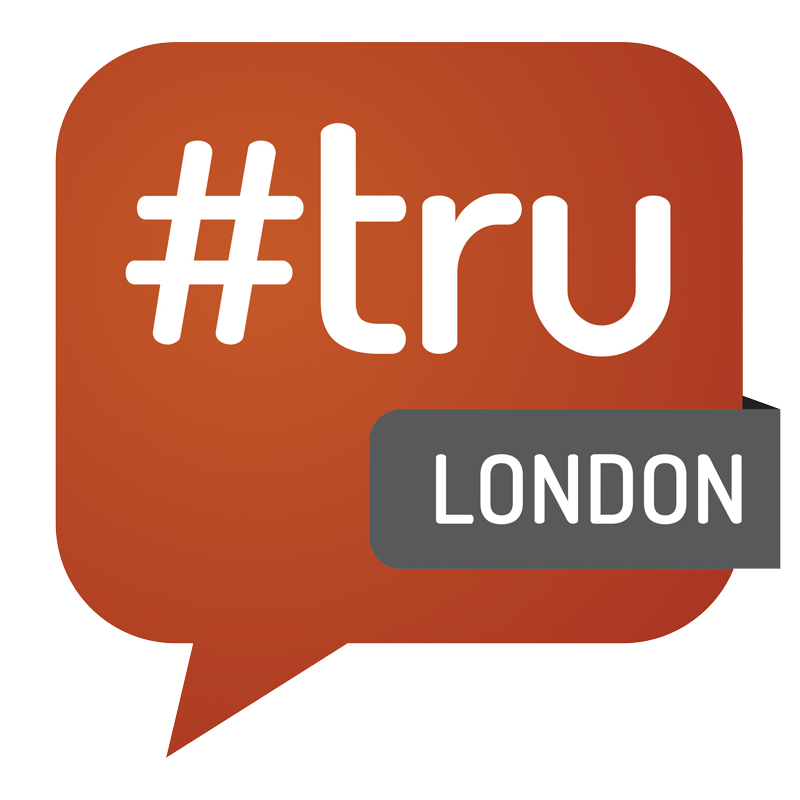
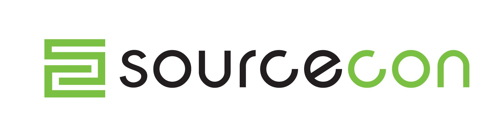
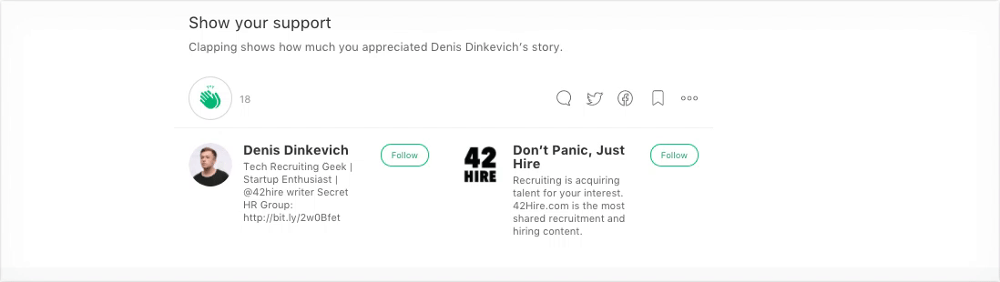

## This is list of the great blogs which I highly recommend to consider for every modern HR/recruitment professional

The pace of work is getting so fast that we barely have time to take a pee break. But we still have to keep up with times and continuously update our brainware. This is list of the great blogs which I highly recommend to consider for every modern hr/recruitment professional:

### [**Social Talent**](https://www.socialtalent.co/blog) **/** [**_Johnny Campbell_**](https://medium.com/@socialtalent)

Social Talent Blog is a blog where you can learn more about recruitment trends and get tips on how to use social media in recruitment process. Here you can also find webinars on various HR topics.

Social Talent Blog is run by [Jonathan Campbell](https://www.linkedin.com/in/johnnycampbell) and [Vincent O’Donoghue](https://www.linkedin.com/in/vincentodonoghue), whose company provide online and social media training to the recruitment and staffing industry worldwide.

---

### [**Recruiting Blogs**](http://www.recruitingblogs.com/) **/** [**_Matt Charney_**](https://medium.com/@mattcharney)**_,_** [**_William Tincup_**](https://medium.com/@tincup)

Talk about an information source! Recruiting Blogs has it all — topical blog posts, industry discussions, webinar & video content, event information, a dedicated recruiting and HR job board, and a selection of whitepapers. There really is something for everyone here.

That is why I love reading recruiting blogs — they have fresher contents and provide really good insights and opinions from experts and thought leaders directly.

---

### [**GlossaryTech**](https://blog.glossarytech.com/) **/** [**_Andrew Stetsenko_**](https://medium.com/@AndrewStetsenko)

GlossaryTech is a free online tool kit for tech recruiters and sourcers, including ‘Bull Sessions with Tech Recruiters’ — recruiting hacks from global IT hunters.

The main purpose of it is make complex tech definitions clear, while providing IT recruiters with a go-to guide to understand the latest and most common terms found in software engineers’ profiles.

---

### [**The Recruiting Unblog**](http://www.recruitingunblog.com/) **/** [**_Bill Boorman_**](https://medium.com/@billboorman)

What started as a 3 month project to promote the first ever #trulondon, became a permanent online entity for Bill Boorman ([@BillBoorman](https://twitter.com/BillBoorman)) and the space in which he’d post all about the things he’s currently thinking and feeling about recruiting, technology, HR and social media.

Bill Boorman is the man in the hat and founder of the #tru Recruiting Unconference. He’s worked in the recruiting space for the last 30 years and is best known for his norm challenging ideas based on the philosophy “_It’s about skills and what people can do, not what bits of paper they have. it is not about job titles. Go look for people, not for CVs_“.

---

### [ERE](http://www.eremedia.com/ere/) / [ToddRaphael](https://medium.com/@ToddRaphael)

ERE was created in 1998 as an online gathering place for recruiters to network, share best practices and above all else, learn from each other. Today the site is best known for it’s extremely prompt delivery of need-to-know information specifically aimed at corporate recruiting professionals.

ERE is not only a good site for corporate recruiting opinion pieces, it is THE place for corporate opinion pieces. If a survey has been released to do with any aspect of the industry, ERE will be there first to tell you how it’s going to affect you, your job and your hires, and how you can deal with it in the best way.

---

### [**Undercover Recruiter**](http://theundercoverrecruiter.com/) **/** [**_Jörgen Sundberg_**](https://medium.com/@jorgensundberg)

The Undercover Recruiter is the number one recruitment and career blog in the UK and Europe and aims to please both recruiting and HR professionals as well as job seekers. As a result, the content this excellent blog delivers is diverse, thought provoking and offers each different type of reader the other’s perspective. Industry trends, CV tips, interview techniques (on both sides of the desk), workplace best practice, and advice on the modern job search are just some of the topics handled on a daily basis with some fascinating insights offered by a variety of different voices in the industry.

---

### [SourceCon](http://www.sourcecon.com/) / [Jeremy Roberts, SPHR](https://medium.com/@imjeremyr), [Jess Roberts](https://medium.com/@jessroberts)

The site nows acts as a vehicle for recruiters and sourcers to share tools, ideas and ways to better themselves as researchers. “_Inform, encourage, and empower_“, that’s the SourceCon goal.

SourceCon is “_by sourcers, for sourcers_” and as such delivers site search tips and tricks, recruitment industry opinion pieces, industry news, survey results, practical advice on trending topics (e.g. gamification)and their use in recruitment, and technology reviews.

**PS**: I am going to edit this post based on your feedback. So if you want me to add something feel free to [**contact me**](https://twitter.com/diskevi4)  or add your thoughts here in the comment section.

### Read my next story → [🔝 3 mistakes to avoid while hiring sales 👩‍💻 to your TECH startup](https://medium.com/@diskevich/3-mistakes-to-avoid-while-hiring-a-sales-person-to-your-startup-9dc91ee885c4)

#### Follow me: [Facebook](https://www.facebook.com/diskevichh) | [LinkedIn](https://www.linkedin.com/in/denisdinkevich/) | [Twitter](https://twitter.com/diskevi4) | [Quora](https://www.quora.com/profile/Denis-Dinkevich)

### If you like my work, please click and hold down the 👏 button for 10 seconds to show your support!
