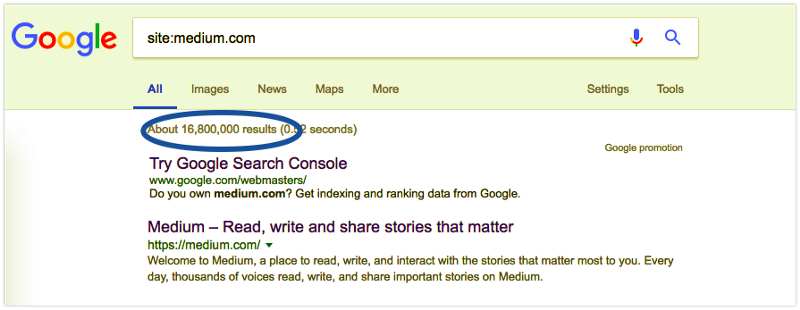

People often complain that site:, by itself, is inaccurate, but the magic is in the combination of site: with other query operators. That's why I’ve come up with two dozen killer combos that can help you dive deep into any site.


#### **1\. site:example.com**

Ok, this one’s not really a combination, but let’s start with the basics. Paired with a root domain or sub-domain, the \[site:\] operator returns an estimated count of the number of indexed pages for that domain. The “estimated” part is important, but we’ll get to that later. For a big picture, I generally stick to the root domain (leave out the “www”, etc.).

Each combo in this post will have a clickable example (see below).

```
[site:medium.com]
```

You’ll end up with two bits of information: (1) the actual list of pages in the index, and (2) the count of those pages (circled in purple below):



  

We can all agree that 16,800,000 results is a whole lot more than most of us would want to sort through. Even if we wanted to do that much clicking, Google would stop us after 100 pages. So, how can we get more sophisticated and drill down into the Google index?

#### **2\. site:example.com/folder**

The simplest way to dive deeper into this mess is to provide a sub-folder (like “/blog" or "/topic/\*") — just append it to the end of the root domain. Don’t let the simplicity of this combo fool you — if you know a site’s basic architecture, you can use it to drill down into the index quickly and spot crawl problems.

```
[site:medium.com/topic]
```

#### **3\. site:sub.example.com**

You can also drill down into specific sub-domains. Just use the full sub-domain in the query. I generally start with #1 to sweep up all sub-domains, but #3 can be very useful for situations like tracking down a development or staging sub-domain that may have been accidentally crawled.

```
[site:ua.linkedin.com]
```

#### **4\. site:example.com inurl:www**

The “inurl:” operator searches for specific text in the indexed URLs. You can pair “site:” with “inurl:” to find the sub-domain in the full URL. Why would you use this instead of #3? On the one hand, “inurl:” will look for the text anywhere in the URL, including the folder and page/file names. For tracking sub-domains this may not be desirable. However, “inurl:” is much more flexible than putting the sub-domain directly into the main query. You’ll see why in examples #5 and #6.

```
[site:linkedin.com inurl:ua]
```

#### **5\. site:example.com -inurl:www**

Adding \[-\] to most operators tells Google to search for anything but that particular text. In this case, by separating out “inurl:www”, you can change it to “-inurl:www” and find any indexed URLs that are **not** on the “www” sub-domain. If “www” is your canonical sub-domain, this can be very useful for finding non-canonical URLs that Google may have crawled.

```
[site:amazon.com -inurl:www]
```

#### **6\. site:amazon.com -inurl:www -inurl:local inurl:aws inurl:pdf**

I’m not going to list every possible combination of Google operators, but keep in mind that you can chain most operators. Let’s say you suspect there are some stray sub-domains, but you aren’t sure what they are. You are, however, aware of “www.”, “dev.” and “shop.”. You can chain multiple “-inurl:” operators to remove all of these known sub-domains from the query, leaving you with a list of any stragglers.

```
[site:amazon.com -inurl:www -inurl:local inurl:aws inurl:pdf]
```

#### **7\. site:example.com -inurl:param**

Keep in mind that you can combine “inurl:” with “-inurl:”, specifically including some parameters and excluding others. For complex, e-commerce sites, these two combos alone can have dozens of. So you can just add \[-\] to your “inurl:” statement to exclude that parameter. 

```
[site:linkedin.com -inurl:(profiles|jobs|dir|group|pulse)]
```

#### **8\. site:example.com keywords goes here**

Of course, you can alway combine the “site:” operator with a plain-old, text query. This will search the contents of the entire page within the given site. Like standard queries, this is essentially a logical \[AND\], but it’s a bit of a loose \[AND\] — Google will try to match all terms, but those terms may be separated on the page or you may get back results that only include some of the terms. You’ll see that the example below matches the phrase “free Kindle books” but also phrases like “free books on Kindle”.

```
[site:amazon.com free kindle books]
```

#### **9\. site:example.com “keywords goes here”**

If you want to search for an exact-match phrase, put it in quotes. This simple combination can be extremely useful for tracking down duplicate and near-duplicate copy on your site. If you’re worried about one of your product descriptions being repeated across dozens of pages, for example, pull out a few unique terms and put them in quotes.

```
[site:amazon.com “free kindle books”]
```

#### **10\. site:example.com/folder “text goes here”**

This is just a reminder that you can combine text (with or without quotes) with almost any of the combinations previously discussed. Narrow your query to just your blog or your store pages, for example, to really target your search for duplicates.

```
[site:linkedin.com/company "software development"]
```

#### **11\. site:example.com "top \* keyword”**

The asterisk \[\*\] can be used as a wildcard in Google queries to replace unknown text. Let’s say you want to find all of the “Top X” posts on your blog. You could use “site:” to target your blog folder and then “Top \*” to query only those posts.

```
[site:amazon.com “top * books”]
```

**_Pro Tip:_** _The wild’card \[\*\] operator will match one or multiple words. So, “top \* questions” can match “Top 40 Books” or “Top Talent Sourcing Books”. Try the sample query above for more examples._

#### **12\. site:example.com ~word**

The tilde \[~\] operator tells Google to find words related to the word in question. Let’s say you wanted to find all of the posts on your blog related to the concept of consulting — just add “~consulting” to the query, and you’ll get the wider set of terms that Google thinks are relevant.

```
[site:linkedin.com ~sourcing]
```

#### **13\. site:example.com ~word -word**

By using \[-\] to exclude the specific word, you can tell Google to find any pages related to the concept that don’t specifically target that term. This can be useful when you’re trying to assess your keyword targeting or create new content based on keyword research.

```
[site:linkedin.com ~sourcing -management]
```

#### **14\. site:example.com intitle:text goes here**

The “intitle:” operator only matches text that appears in the <TITLE></TITLE> tag. One of the first spot-checks I do on any technical SEO audit is to use this tactic with the home-page title (or a unique phrase from it). It can be incredibly useful for quickly finding major duplicate content problems.

```
[site:linkedin.com intitle:”talent sourcing”]
```

#### **15\. site:example.com intitle:text \* here**

You can use almost any of the variations mentioned in (12)-(17) with “intitle:” — I won’t list them all, but don’t be afraid to get creative. Here’s an example that uses the wildcard search in #14, but targets it specifically to page titles.

```
[site:linkedin.com intitle:the sourcing *]
```

**_Pro Tip:_** _Remember you can use quotes around the phrase after “intitle:”, or Google will view the query as a one-word title search plus straight text. For example, “intitle:text goes here” will look for “text” in the title plus “goes” and “here” anywhere on the page._

#### **16\. site:example.com ”text goes here” -intitle:text goes here**

You might think that #22 and #23 are the same, but there’s a subtle difference. If you use “intext:”, Google will ignore the <TITLE> tag, but it won’t specifically remove anything with “text goes here” in the title. If you specfically want to remove any title mentions in your results, then use “-intitle:”.

```
[site:amazon.com intext:”best book ever” -intitle:”best book ever”]
```

#### **17\. site:example.com filetype:pdf**

One of the drawbacks of “inurl:” is that it will match any string in the URL. So, for example, searching on “inurl:pdf”, could return a page called “/guide-to-creating-a-great-pdf”. By using “filetype:”, you can specify that Google only search on the file extension. Google can detect some filetypes (like PDFs) even without a “.pdf” extension, but others (like “html”) seem to require a file extension in the indexed document.

```
[site:s3.amazonaws.com filetype:pdf]
```

#### **18\. site:.edu “text goes here”**

Finally, you can target just the Top-Level Domain (TLD), by leaving out the root domain. This is more useful for link-building and competitive research than on-page SEO, but it’s definitely worth mentioning. One of our community members, Himanshu, has an excellent post on his own blog about using advanced query operators for link-building.

```
[site:.edu “talent sourcing”]
```

#### **Why No allintitle: & allinurl:?**

Experienced sourcers may be wondering why I left out the operators “allintitle:” and “allinurl:” — the short answer is that I’ve found them increasingly unreliable over the past couple of years. Using “intitle:” or “inurl:” with your keywords in quotes is generally more predictable and just as effective, in my opinion.
