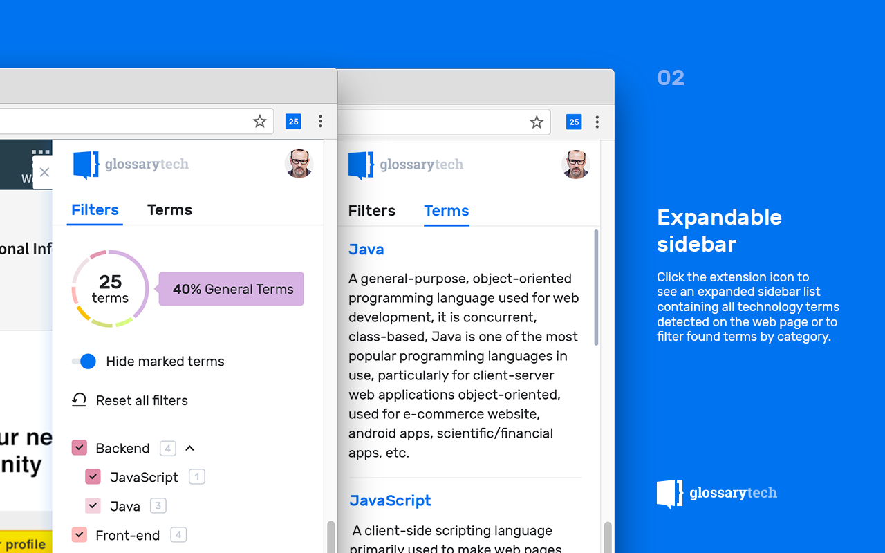

Keeping up with technology **is not an easy feat.** And neither is getting around to it. However, it’s paramount if you want to source and attract top tech talent. Thankfully, there is a ton of tools available that are **exceedingly helpful.** The [**Chrome Extension GlossaryTech for LinkedIn**](https://glossarytech.com/plugin) is one of them.

Originally intended for **sourcing technical talent on LinkedIn**, the extension can also be used to learn programming terms on any website, e.g. **GitHub, StackOverflow, Wikipedia**, etc. The extension **detects and highlights** tech terms on a web page, provides their clear, concise definitions, as well as allows to **filter the terms by category (Front-end, Back-end, QA, etc).**

---

### Here’s a detailed guide on how-to use it:

-   [**Install**](https://chrome.google.com/webstore/detail/glossarytech-for-linkedin/lkfaknngnekohfmljebdikgefjfhkgkp?hl=en) the plug-in from the Chrome Web Store. It’s absolutely **FREE.**
-   Go to the LinkedIn profile you’re interested in. **Click on the extension icon** **to detect tech terms** included in the profile.

**_NOTE:_** _The icon will keep you informed when a tech term has been detected._

#### To filter the terms by category, use the sidebar. For this, just click the icon in the ribbon. **Each category has its own color.**

#### Besides, there’s a **_“Terms”_** tab in the sidebar (see above). Switch to it if you want to explore the technical terms detected in more detail.

<Embed src="https://www.youtube.com/embed/rSUNMvzve-Q?feature=oembed" aspectRatio={undefined} caption="**FYI,** there’s is a quick video on **how-to** use the extension." />

You’re now ready to put the [**GlossaryTech Chrome Extension**](https://glossarytech.com/plugin) to good use. Make sure that you install the tool so that you can employ it when you’re trying to seek out tech candidates. Happy hunting!

#### **_P.S._** _Don’t forget to share the tool with your friends and colleagues — the more the merrier… _😜

### Read my next story → [🔎 mastering “Tell me about yourself?” interview question 🤔](https://medium.com/42hire-don-t-panic-just-hire/mastering-the-tell-me-about-yourself-job-interview-question-fe790ba17c73)

#### Follow me: [Facebook](https://www.facebook.com/diskevichh) | [LinkedIn](https://www.linkedin.com/in/denisdinkevich/) | [Twitter](https://twitter.com/diskevi4) | [Quora](https://www.quora.com/profile/Denis-Dinkevich)

### If you like my work, please click and hold down the 👏 button for 10 seconds to show your support!
