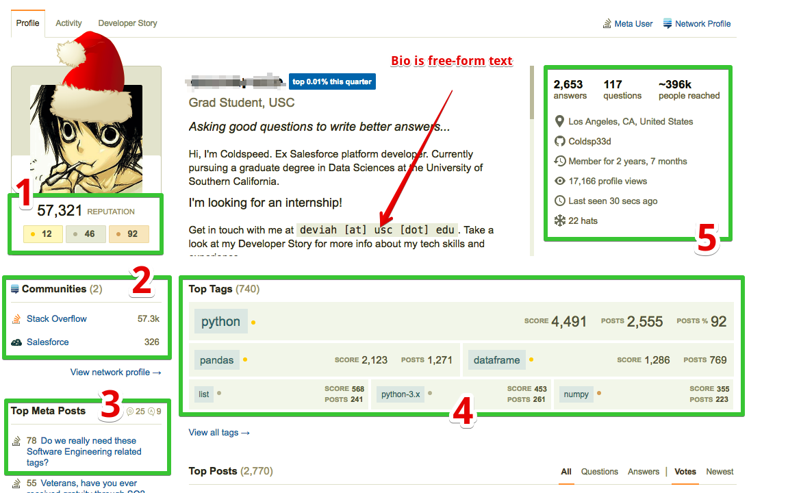
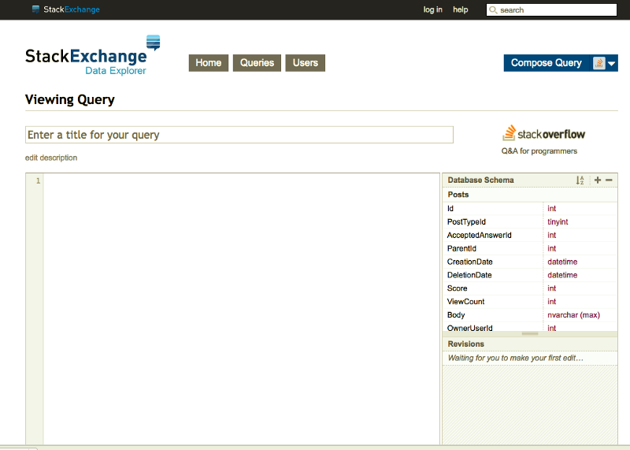
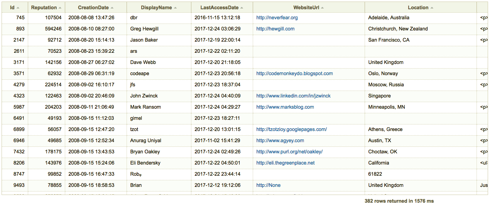

## The most talented engineers are on StackOverflow, so if you want to understand and attract them, you must be there as well. Ready? Let's figure out if we'll able to get on it!


For those who didn’t hear about [**Stack Overflow**](https://stackoverflow.com/) at all I’ve decided to put some of the basics explanation regarding how to get the most of it. SO is one of the sites created on [**Stack Exchange**](https://data.stackexchange.com/), as a **Q&A** platform.

[**Stack Overflow**](https://stackoverflow.com/)  is basically the place your prospects (engineers and/or just techie people) spending the most of their **free(!)** time. That shouldn't sounds for you like an easy way to solve your problems, tech recruiters might not be as acquainted with the platform.

Before **Stack Overflow launched in 2008**, developers had a hard time finding the help they needed. Tech forums weren’t user-friendly, and it was nearly impossible to know whether or not you were getting sound advice. Some were behind paywalls that were cost-prohibitive. And others were a combination of all of these things.

Stack Overflow solved all of these problems for developers. Its user-friendly platform makes it easy for developers to ask questions and find the answers to their most significant coding challenges. Every answer is peer-reviewed and verified by moderators and fellow users. Plus, it’s 100% free to sign up and participate.

> **Today, over 50 million developers use the site each month**

The great thing is that everyone is spending their time on SO only because they actually want and/or need it indeed. The pretty exciting thing is that every developer who’s already asking/answering questions on SO, already feels like good enough, huh? 😃

> **~1.3M of active users** in the last two weeks **(Nov 2017)**

Well, I mean just because of their remarkable curiosity/involvement level I’d also mention that the most of them are doing there by looking to become great soon. So why don’t you look no further and start hiring them NOW?

And the most powerful opportunity you’ll have is that they put a lot of insanely relevant data regarding their ongoing learning process. Such a **great icebreakers** for you to reach, **engage and win!** As well as evaluating an early adopters and rocking w the best talents being hired ;)

Questions and answers as well are separated by the tags, you can find the complete list of them [**here.**](https://stackoverflow.com/tags%5C)  They also have a [**“synonyms for..”**](https://stackoverflow.com/tags/java/synonyms) feature which is pretty handy way to deeper dig into specific technology you’re currently working on.

### The Anatomy of the Stack Overflow Profile



At first glance, this might look like it’s written in a foreign language. Before we go any further, let’s review some of the basic terms that you should know when you’re browsing a Stack Overflow profile

1👉 **Reputation:** how many Bronze, Silver and Gold badges earned by user

2 👉 **_Bio_**: is free-form text section. You can find it even without accessing someone’s SO profile

3👉 **_Communities:_** _provide you the complete picture regarding someone’s area of specialization._

4 👉 **_Top Tags Contributed To:_** _how to engage wisely and succeed._

5👉 **_Info:_** _location, education, Github, “Last seen..” feature etc_

6👉 **Username:** y_ou can go through the_ 🔥 [**_Namechk_**](https://namechk.com) _and find it elsewhere at the web (_**_100+_** _social media listed there)_

---

#### Technologies

Usually on a resume, you’ll find a list of programming languages that a candidate has worked with in the past. But on a Stack Overflow candidate profile, they’ll tell you which technologies they want to work with. If you know that your company can give them the opportunity to use (or learn) those languages, don’t be shy about highlighting that.

#### Does the developer have a blue badge next to his or her name?

A blue badge with a percentile indicates that person’s overall rank on Stack Overflow, based on all-time reputation points. If a candidate has one of these blue badges, this tells you that they’re trusted by a large audience of their coding peers — and that **they’re willing to share their knowledge**.

#### Start by looking at the candidate’s Top Tags and Badges.

Do these programming languages match your tech stack? If so, this is a good indication that this person has the skills required to hit the ground running on Day 1. It’s also an easy way to find out which programming languages they’re passionate about using.

#### Open Source

The Education section should tell you everything you need to know about a candidate’s skills, right? Not when you’re recruiting developers. In fact, some of the most talented programmers don’t hold college degrees. So when a candidate includes links to open source projects, take them back to your engineering managers to evaluate before you make any recruiting decisions.

Now when you already being familiar w the SO profile’s anatomy it’s time to discover some real practices on how to find and reach prospects you are looking for and rock together!

**Ready? Look no further👇 :)**

### Finding engineering unicorns on Stack Overflow using queries from Stack Exchange



As mentioned above Stack Oveflow is part of the Stack Exchange metasystem, and the profiles are linked together — you’re able to use the information found on any of these.

We’ll navigate through Stack Overflow w the help of pre-builded queries. Check  [**this link**](https://data.stackexchange.com/stackoverflow/query/new) to start building your first query. I’ve putted top of my favorites queries below.

Feel free to **grab it, copy and run! 😃**

#### **#1** [**Top 1000 Users Near Me**](https://data.stackexchange.com/stackoverflow/query/59468/top-1000-users-near-me)

```
select top 1000
       u.id as [User ID],
       u.displayname as [User Name],
       u.reputation as [User Rep]
from users u
where upper(u.location) like upper('%' + ##YourLocation:string## + '%') -- uppercase location--
ORDER BY u.reputation DESC, u.UpVotes DESC
```

#### #2 [Users With Gold Badges Related to a Given Tag](https://data.stackexchange.com/stackoverflow/query/618263/so-users-with-gold-badges-related-to-a-given-tag)

```
DECLARE @myUsers TABLE
(
Id int,
Reputation int,
CreationDate datetime,
DisplayName nvarchar(40), 
LastAccessDate datetime, 
WebsiteUrl nvarchar(200),
Location nvarchar(100), 
AboutMe nvarchar(max), 
Views int,
UpVotes int,
DownVotes int,
ProfileImageUrl nvarchar (200),
EmailHash varchar (32),
Age int,
AccountId int
)

DECLARE @myBadges TABLE
(
Id int,
UserId int,
Name nvarchar (50),
Date datetime,
Class tinyint,
TagBased bit
)

INSERT INTO @myBadges (Id, UserId, Name, Date, Class, TagBased)
SELECT Id, UserId, Name, Date, Class, TagBased
FROM Badges b
WHERE UPPER(b.name) LIKE UPPER('%' + ##Tag:string## + '%') AND b.TagBased = 1 AND b.Class = 1


INSERT INTO @myUsers (Id, Reputation, CreationDate, DisplayName, LastAccessDate, WebsiteUrl, Location, AboutMe, 
Views, UpVotes, DownVotes, ProfileImageUrl, EmailHash, Age, AccountId)
SELECT Id, Reputation, CreationDate, DisplayName, LastAccessDate, WebsiteUrl, Location, AboutMe, 
Views, UpVotes, DownVotes, ProfileImageUrl, EmailHash, Age, AccountId
FROM Users u
WHERE u.Id IN (SELECT UserId FROM @myBadges)

SELECT * FROM @myUsers
```

#### #3 [Users in Your City (with user-links)](https://data.stackexchange.com/stackoverflow/query/9320/find-stack-overflow-users-in-your-city-with-user-links)

```
-- Find Stack Overflow Users In Your City (with user-links)
-- A simply query to find users in your city or country. Added user links.

select Id [User Link], Reputation, DisplayName, Location
from Users
where Location like '%##Location##%'
order by Reputation desc
```

#### #4 [Top Users by Country and Tag](https://data.stackexchange.com/stackoverflow/query/194306/top-users-by-country-and-tag)

```
-- Top Users by Country and tag
-- Created by samliew (http://stackoverflow.com/users/584192/samuel-liew)

SELECT
    ROW_NUMBER() OVER(ORDER BY Reputation DESC) AS [#], 
    u.Id AS [User Link], 
    u.Reputation,
    count(p.id)
FROM
    Users u
inner join posts p on p.ownerUserid = u.id
inner join posttags pt on pt.postid = p.id
inner join tags t on t.id = pt.tagid
WHERE
    LOWER(Location) LIKE LOWER('%##countryname##%')
    and t.tagname='##tagname##'
group by u.reputation, u.id
ORDER BY
    Reputation DESC;
```

#### #5 [Most Upvoted Answers](https://data.stackexchange.com/stackoverflow/query/36656/most-upvoted-answers)

```
-- Most Upvoted Answers of All Time
-- The most Upvoted qAnswers of All Time on SO

select top 20 count(v.postid) as 'Vote count', v.postid AS [Post Link],p.body
from votes v 
inner join posts p on p.id=v.postid
where PostTypeId = 2 and VoteTypeId=2
group by v.postid,p.body
order by 'Vote count' desc
```

#### #6 [StackOverflow Rank and Percentile](https://data.stackexchange.com/stackoverflow/query/6772/stackoverflow-rank-and-percentile)

```
-- StackOverflow Rank and Percentile

WITH Rankings AS (
SELECT Id, Ranking = ROW_NUMBER() OVER(ORDER BY Reputation DESC)
FROM Users
)
,Counts AS (
SELECT Count = COUNT(*)
FROM Users
WHERE Reputation > 100
)
SELECT Id, Ranking, CAST(Ranking AS decimal(20, 5)) / (SELECT Count FROM Counts) AS Percentile
FROM Rankings
WHERE Id = ##UserId##
```

#### #7 [Self-answered Questions 🔥](http://data.stackexchange.com/stackoverflow/query/29974/self-answered-questions)

Kinda scam tester :) Check who's not fair and be able to choose if you're interested in such a deal or no.

```
-- Self-answered questions
-- How many of their own questions has a user answered?

select
    Q.OwnerUserId as [User Link],
    Q.OwnerUserId [User ID],
    Count(distinct A.ParentID) [Self-Answered],
    count(*) [Questions],
    convert(decimal(10,2),100) * Count(distinct A.ParentID) / count(*) [Percentage],
    rank() over (order by convert(decimal(10,2),100) * Count(distinct A.ParentID) / count(*) desc) [Rank]
from Posts Q 
left join Posts A on Q.Id = A.ParentId and Q.OwnerUserId = A.OwnerUserId
where Q.OwnerUserId is not null and Q.PostTypeId = 1
group by Q.OwnerUserId
having count(*) > 100
order by case when Q.OwnerUserID != ##UserId## then 1 end, Percentage desc
```

#### #8 [Get Country and Reputation Wise Rank](https://data.stackexchange.com/stackoverflow/query/425112/get-country-reputation-wise-rank)

Compare the users from your country and be able to hire the best available on the market indeed :)

```
SELECT
    ROW_NUMBER() OVER(ORDER BY Reputation DESC) AS [#], 
    Id AS [User Link], 
    Reputation
FROM
    Users 
WHERE
    LOWER(Location) LIKE LOWER('%##CountryName##%')
    AND Reputation > ##Reputation##
ORDER BY
    Reputation DESC;
```

#### #9 [Number of Questions Per User by First Tag](https://data.stackexchange.com/stackoverflow/query/488790/number-of-questions-per-user-by-first-tag)

Might help you to figure out how someone is skilled and/or interested in specific technology (programming language etc.)

```
-- TagName: Tag Prefix "Enter the initial portion of a tag"
WITH FirstQuestionTags AS 
(
    SELECT p.Id, p.OwnerUserId, p.ClosedDate, pt.TagId, RANK() OVER (PARTITION BY p.OwnerUserId ORDER BY p.Id) AS [Rank]
    FROM PostsWithDeleted p
    INNER JOIN PostTags pt ON pt.PostId = p.Id
    WHERE p.PostTypeId = 1
),
FirstTagMatches AS
(
  SELECT fqt.Id, fqt.OwnerUserId, fqt.ClosedDate
  FROM FirstQuestionTags fqt
  INNER JOIN Tags t ON t.Id = fqt.TagId
  WHERE fqt.Rank = 1 AND t.TagName LIKE ##TagName:string## + '%'
)
SELECT DISTINCT 
  CASE
    WHEN p.PostTypeId = 1 THEN 'Post'
    WHEN p.PostTypeId = 2 THEN 'Answer'
    ELSE ''
  END AS [Post Type],
  ftm.OwnerUserId AS [User Link], 
  COUNT(*) AS [Additional Posts]
FROM FirstTagMatches ftm
LEFT OUTER JOIN Posts p ON p.OwnerUserId = ftm.OwnerUserId AND ftm.Id != p.Id AND (ftm.Id != p.ParentId OR p.parentId IS NULL)
WHERE (( p.PostTypeId IN ( 1, 2 ) ) OR ( p.Id IS NULL ))
GROUP BY p.PostTypeId, ftm.OwnerUserId
ORDER BY 3 DESC
```

#### #10 [The most recent answers tagged X from user Y containing text like Z 🔥](http://data.stackexchange.com/stackoverflow/query/29546/n-most-recent-answers-tagged-x-from-user-y-containing-text-like-z)

```
-- N most recent answers tagged X from user Y containing text like Z
-- Show the N most recent answers tagged X from user Y containing text like Z. See also http://data.stackexchange.com/stackoverflow/qe/1070

declare @tagid int,
        @liketext varchar

SET nocount on

SELECT @tagid = Id FROM Tags WHERE TagName = ##JustOneTag:string##

SELECT TOP ##Limit##
    p.Id as [Post Link],
    p.CreationDate as [Answer Date]
FROM
    Posts p
INNER JOIN
    PostTags pt ON p.ParentId = pt.PostId AND pt.TagId = @tagid
WHERE
    p.PostTypeId = 2 -- 2 = Answer
    AND p.OwnerUserId = ##UserId##
    AND (p.Title LIKE ##TextUsingLikeSyntax:string##
         OR
         p.Body LIKE ##TextUsingLikeSyntax:string##)
ORDER BY
    p.CreationDate DESC
```

---

### 🔥 GOOGLE X-RAY BONUS:

If queries mentioned above doesn’t help, you can always X-ray Stacqk Overflow w the help of Google, Bing and other search engines as well. I’ll share the most useful of them below:

[**_site:careers.stackoverflow.com -inurl:jobs|meetup|company|cities_**](https://www.google.com/search?q=site%3Acareers.stackoverflow.com+-jobs+-inurl%3Acompany&rlz=1C1CHFX_enUS499US499&oq=site%3Acareers.stackoverflow.com+-jobs+-inurl%3Acompany&aqs=chrome..69i57j69i58.1592j0j9&sourceid=chrome&es_sm=93&ie=UTF-8#q=site:careers.stackoverflow.com+-inurl:jobs%7Cmeetup%7Ccompany%7Ccities)

[**_site:stackoverflow.com/users jdk OR jre OR j2se OR java_**](https://www.google.hu/webhp?sourceid=chrome-instant&ion=1&espv=2&ie=UTF-8#q=site:stackoverflow.com%2Fusers+jdk+OR+jre+OR+j2se+OR+java)

[**_site:careers.stackoverflow.com -inurl:jobs|meetup|company|cities Paris java OR jdk OR j2se OR jre_**](https://www.google.hu/search?q=site%3Acareers.stackoverflow.com+-inurl%3Ajobs%7Cmeetup%7Ccompany%7Ccities&oq=site%3Acareers.stackoverflow.com+-inurl%3Ajobs%7Cmeetup%7Ccompany%7Ccities&aqs=chrome..69i57j69i58j69i60l3.175j0j7&sourceid=chrome&es_sm=93&ie=UTF-8#q=site:careers.stackoverflow.com+-inurl:jobs%7Cmeetup%7Ccompany%7Ccities+Paris+java+OR+jdk+OR+j2se+OR+jre+)

### How-to engage engineers you are interested in co-operating with?


As noted before, this is a site where you will find questions and answers posted by software developers about their work. I suggest to order on newest, and first check if the user has any answers.

If you have searched in  [**Stack Careers**](https://stackoverflow.com/jobs/developer-jobs-using-r%2bor%2bmachine-learning), users not only provide more information about their other social profiles and contact details, but also their full names. So you can use your full sourcing inventory of phone directories, people aggregators, social media and Google searches, and if everything else fails finding out their company mail address or cold calling in.

Websites are relatively frequent to appear in someone's SO profile page. Once you have that, you can go to [**whois.com**](http://whois.com/), and use the search bar in the top right to find out details about the registrant (and email as well).

If you do not have a website, Email, picture (for Image Search) or real name of someone, go for 🔥 [**namechk.com**](http://namechk.com/) and see if the person with that username might use something else as well. You can check the example of this approach above.

 **🤩**](./asset-6.png)

The basic idea — find information about the candidates and use them to stand out from the crowd **with your contact attempt.** While checking a profile you will see on the right side the **“Communities”** tab, which are also full of relevant info that might be pretty useful for your success.

I've putted a several examples of the first outreach attempts below. Feel free to use them as they are and/or customize, create your own and use them as well :)

> Of course finding a candidate’s Stack Overflow profile is not even a question if you were searching for them there in the first place. © [Vince Szymczak](https://www.linkedin.com/in/vinceszymczak/)

S**ubject**: I saw your Android/Async task question on StackOverflow

E**mail**: and I admit I do not even understand half of it. What I do understand however is that you are developing an Android app — something our company would need!

S**ubject**: I’ve found your jquery.qrcode.js plugin..

E**mail**: .. to be especially well documented, I could understand the functionality even without being a software engineer myself. Did you enjoy working on it? I would have an opportunity where you could work with related technology.


Well, **that’s pretty much it.** Now **GO and get them ALL! 😃**

#### Have any other tip to add? Comment below! Do not have any other tip to add? Share it with your network!

#### **If you like the topic and find it useful, don’t forget to 👏 👏👏👏👏👏**
