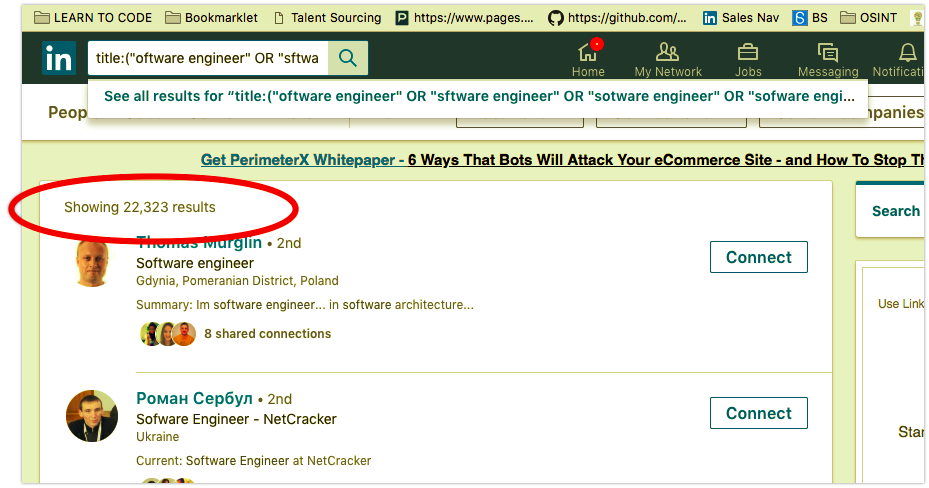

I remember when I first read that you can deliberately use typos to expand the funnel in [**_Jan Tegze’s book_**](https://www.amazon.com/Full-Stack-Recruiter-Modern-Recruiters/dp/1976130735)**_._** today I want to share with you the way that has expanded my search query for **20K results** 🔥 (see below)

Recently I've found a [**_wonderful SEO tool_**](http://tools.seobook.com/spelling/keywords-typos.cgi) that helped me generate all the possible typos for the _“software engineer”_ phrase. and here’s what happened:

oftware engineer

sftware engineer

sotware engineer

sofware engineer

softare engineer

softwre engineer

softwae engineer

softwar engineer

software ngineer

software egineer

software enineer

software engneer

software engieer

software enginer

software enginer

software enginee

ssoftware engineer

sooftware engineer

sofftware engineer

softtware engineer

softwware engineer

softwaare engineer

softwarre engineer

softwaree engineer

software eengineer

software enngineer

software enggineer

software engiineer

software enginneer

software engineer

software engineer

software engineerr

osftware engineer

sfotware engineer

sotfware engineer

sofwtare engineer

softawre engineer

softwrae engineer

softwaer engineer

softwar eengineer

software negineer

software egnineer

software enigneer

software engnieer

software engiener

software enginere

Then I used this formula to simply put each statement into the quotes with additional space and OR from the right side:

_\=CHAR(34)&”_**_CELL\_NUMBER_**_”&CHAR(34)&” OR”_

After applying the formula you should get smth like this if everything went well:

oftware engineer 👉 “oftware engineer” OR

sftware engineer 👉 “sftware engineer” OR

sotware engineer 👉 “sotware engineer” OR

sofware engineer 👉 “sofware engineer” OR

Now you can build a query by using the titlle: operator on LinkedIn advanced search.

[**_title:(“oftware engineer” OR “sftware engineer” OR “sotware engineer” OR “sofware engineer” OR “softare engineer” OR “softwre engineer” OR “softwae engineer” OR “softwar engineer” OR “software ngineer” OR “software egineer” OR “software enineer” OR “software engneer” OR “software engieer” OR “software enginer” OR “software enginer” OR “software enginee” OR “ssoftware engineer” OR “sooftware engineer” OR “sofftware engineer” OR “softtware engineer” OR “softwware engineer” OR “softwaare engineer” OR “softwarre engineer” OR “softwaree engineer” OR “software eengineer” OR “software enngineer” OR “software enggineer” OR “software engiineer” OR “software enginneer” OR “software engineeer” OR “software engineeer” OR “software engineerr” OR “osftware engineer” OR “sfotware engineer” OR “sotfware engineer” OR “sofwtare engineer” OR “softawre engineer” OR “softwrae engineer” OR “softwaer engineer” OR “softwar eengineer” OR “software negineer” OR “software egnineer” OR “software enigneer” OR “software engnieer” OR “software engiener” OR “software enginere”)_**](https://www.linkedin.com/search/results/index/?keywords=title%3A%28%22oftware%20engineer%22%20OR%20%22sftware%20engineer%22%20OR%20%22sotware%20engineer%22%20OR%20%22sofware%20engineer%22%20OR%20%22softare%20engineer%22%20OR%20%22softwre%20engineer%22%20OR%20%22softwae%20engineer%22%20OR%20%22softwar%20engineer%22%20OR%20%22software%20ngineer%22%20OR%20%22software%20egineer%22%20OR%20%22software%20enineer%22%20OR%20%22software%20engneer%22%20OR%20%22software%20engieer%22%20OR%20%22software%20enginer%22%20OR%20%22software%20enginer%22%20OR%20%22software%20enginee%22%20OR%20%22ssoftware%20engineer%22%20OR%20%22sooftware%20engineer%22%20OR%20%22sofftware%20engineer%22%20OR%20%22softtware%20engineer%22%20OR%20%22softwware%20engineer%22%20OR%20%22softwaare%20engineer%22%20OR%20%22softwarre%20engineer%22%20OR%20%22softwaree%20engineer%22%20OR%20%22software%20eengineer%22%20OR%20%22software%20enngineer%22%20OR%20%22software%20enggineer%22%20OR%20%22software%20engiineer%22%20OR%20%22software%20enginneer%22%20OR%20%22software%20engineeer%22%20OR%20%22software%20engineeer%22%20OR%20%22software%20engineerr%22%20OR%20%22osftware%20engineer%22%20OR%20%22sfotware%20engineer%22%20OR%20%22sotfware%20engineer%22%20OR%20%22sofwtare%20engineer%22%20OR%20%22softawre%20engineer%22%20OR%20%22softwrae%20engineer%22%20OR%20%22softwaer%20engineer%22%20OR%20%22softwar%20eengineer%22%20OR%20%22software%20negineer%22%20OR%20%22software%20egnineer%22%20OR%20%22software%20enigneer%22%20OR%20%22software%20engnieer%22%20OR%20%22software%20engiener%22%20OR%20%22software%20enginere%22%29&origin=GLOBAL_SEARCH_HEADER)

And you know what? I get 20K more software engineers available for me to get in touch with which I would never ever find if just looking for right spelled headlines and being a boring sourcer.

